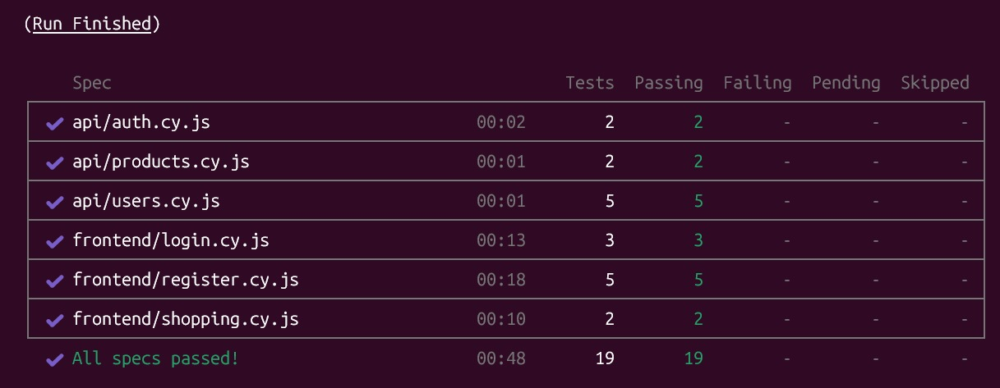
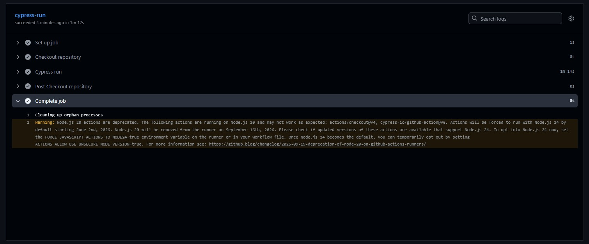
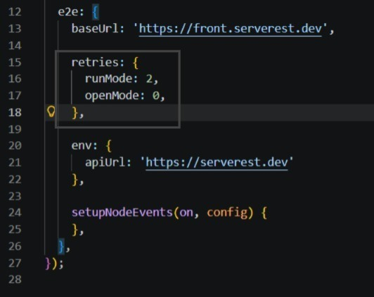

# 🚀 Desafio Técnico: Analista de Testes Senior

<div align="center">


</div>

---

# 📝 Apresentação da Atividade

Este projeto representa a entrega técnica para a avaliação de **Analista de Testes Senior**.

O foco central foi o desenvolvimento de uma suíte de testes automatizados para a plataforma **ServeRest**, abrangendo as camadas de interface (**Frontend**) e serviços (**API**).

Como profissional Senior, a arquitetura foi pensada para ser:

- escalável
- reutilizável
- desacoplada
- de fácil manutenção

Aplicando padrões de engenharia de software que garantem:

- confiabilidade do pipeline de qualidade
- rápida identificação de regressões
- facilidade de evolução da automação

---

# 🏗️ Estratégia e Padrões de Projeto

## ✅ Page Objects Pattern (PoP)

Implementado para desacoplar a lógica de teste da estrutura HTML, garantindo maior manutenibilidade e reutilização de código.

---

## ✅ Custom Commands

Abstração de comportamentos repetitivos para tornar os testes mais limpos, legíveis e reutilizáveis.

---

## ✅ Data-Driven Testing

Gerenciamento de massa de dados através de `factories`, permitindo testes parametrizados e maior flexibilidade.

---

## ✅ Assertions

Escrita de assertions claras e semânticas para facilitar entendimento e manutenção dos testes.

---

# 📋 Cenários Automatizados

# 💻 Frontend (E2E)

### URL:
https://front.serverest.dev/

---

## ✅ Cadastro de Usuário

Validação do fluxo crítico de registro de usuários.

### Cobertura:
- cadastro de usuário
- validação de mensagens de erro por campos obrigatórios não preenchidos

---

## ✅ Login e Autenticação

Validação de fluxo de autenticação da aplicação.

### Cobertura:
- login utilizando credenciais válidas
- login utilizando credenciais inválidas
- login com usuário inexistente

---

## ✅ Gestão de Carrinho

Fluxo principal da jornada de compra do usuário.
Observação:
A funcionalidade completa de conversão da lista em carrinho/checkout ainda apresenta comportamento inconsistente na aplicação ServeRest, portanto os cenários foram adaptados para validar integralmente o fluxo atualmente funcional da aplicação.

### Cobertura:
- adicionar produto a lista
- limpar lista de produtos
- fluxo de criação de usuário e produto integrando backend e frontend

---

# 🔌 API (Rest)

### Swagger:
https://serverest.dev/

---

## ✅ Autenticação

Validação de autenticação via API.

### Cobertura:
- login válido
- login com credenciais inválidas (teste sendo ignorado pois o retorno da API está em desacordo)
- validação de retorno

---

## ✅ Gestão de Usuários

Operações CRUD de usuários.

### Cobertura:
- criar usuário
- consultar usuário
- editar usuário
- remover usuário

---

## ✅ Catálogo de Produtos

Validação de endpoints protegidos de produtos.

### Cobertura:
- criação autenticada
- listagem de produtos
- criação d eprodutos sem autorização
- criação de produtos com token inválido

---
# 💻 Testes de API via interface gráfica

Segue abaixo um link de uma colection desenvolvida no Postman, também executando testes de serviços, todos baseados na documentação fornecida pela plataforma.


<a href="https://documenter.getpostman.com/view/18794515/2sBXqRjcb9" target="_blank">Collection!</a>

---

# 💻 Clonando projeto

Obs: É necessário que o Node e o npm estejam instalados, para descobrir se já possui, execute o comando abaixo:

```bash
node -v
npm -v
```
O resultado deve ser semelhante a imagem abaixo:


Caso não tenha, faça o download pelo site oficial

https://nodejs.org/pt-br/download


1. Clone o repositório para a sua máquina:
```bash
git clone https://github.com/leoBarrosDev/mouts-qa.git
```
2. Acesse a pasta do projeto:
```bash
cd mouts-qa
```
3. Instale as dependências do projeto:
```bash
npm install
```
4. Inicie o Cypress na interface gráfica:
```bash
npx cypress open
```
Caso queira executar os testes, mas não em modo gráfico, basta executar o comando abaixo:
```bash
npx cypress run
```



5. No Cypress Test Runner, selecione o arquivo de teste ou a pasta desejada para executar os cenários.

---

# 📝 Screenshots

 O Cypress registra as imagens automaticamente em caso de falhas no teste. Essas imagens são guardadas nesse diretório, muito úteis para inspeção visual de falhas e para documentação do comportamento da aplicação em diferentes cenários. Foram adicionas apenas algumas de forma direta, mesmo na ausência de falhas a título de demonstração.

---

# 📋 Vídeos

 Este diretório contém gravações em vídeo das execuções dos testes quando a opção de vídeo está habilitada no Cypress. Facilita a análise passo a passo de falhas intermitentes e a revisão do fluxo de testes.

Nenhum dos dois diretórios acima estão sendo enviados para o repositório remoto.
	
---

## ⚙️ CI/CD & Instabilidade de Ambiente (Flakiness)

Este projeto conta com uma esteira de Integração Contínua (CI) via **GitHub Actions** que executa a suíte de testes automaticamente a cada push/pull request, submetidos as branchs main e develop.

> **Nota sobre a execução em CI:** Como os testes são validados em um ambiente público de testes simulados (amplamente utilizado pela comunidade), o servidor alvo pode apresentar lentidão ou variações de resposta sob carga severa. Isso pode ocasionalmente gerar falhas intermitentes (*flakiness*) na esteira do GitHub Actions devido a *timeouts* de rede, embora a suíte de testes permaneça estável e com taxa de 100% de sucesso em execuções locais. Com o objetivo de mitigar esse problema a esteira está configurada para que uma segunda tentativa seja executada em caso de falha, isso não se aplica para execuções locais.

### Melhores práticas e critérios para retries (observação para QA Sênior)

- Nâo é algo tão simples identificar quando a falha é algo apenas relacionado a ambiente, mas podemos começar avaliando timeouts de rede, erros 5xx intermitentes da API, latência elevada e falhas de infraestrutura (DNS, rate limiting) tipicamente indicam problemas ambientais.

- Reproduzindo os testes localmente e em diferentes ambientes (local, staging, CI), se falha ocorrer apenas esporadicamente no CI público e não localmente, tende a ser flakiness e não necessariamente um Bug. A triagem pode contar com apoio de logs, stack traces, e evidências (screenshots/vídeo) para triagem.

- Gerar dadoso e não acompanhar e metrificar também seria um erro, pensando nisso seria interessante a taxa de falha por teste ao longo do tempo, tempo médio de resposta, percentuais de testes com retries acionados, e frequência de status 5xx/4xx do serviço.

- O uso das factories como ocorre no projeto é para isolar a massa de dados e tornar a mesma igualmente potente, sempre seguindo um padrão, mas não sendo a mesma

- É preciso entender que não devemos fazer o uso indiscriminadamente do retry dos testes, isso pode mascarar grandes problemas. Devemos fazer uso do retry apenas para falhas não-determinísticas claramente relacionadas à infraestrutura (timeouts/transientes). Não usar retry para assertions ou comportamentos funcionais determinísticos — esses exigem investigação imediata.
Retry pode mascarar problemas reais se não houver critérios explícitos e monitoramento. Para cada teste com retry ativado deve existir: i) justificativa documentada; ii) limite de tentativas; iii) alerta/visibilidade quando retries ocorrem frequentemente, para análise e correção da causa raiz.





---

## 🤝 Contribuições e Feedbacks

Este é um projeto de portfólio aberto e toda e qualquer sugestão de melhoria, crítica construtiva ou relatório de bug é super bem-vinda! 

Se você encontrou algo que possa ser otimizado (seja na estrutura dos testes, boas práticas de código, performance ou na própria pipeline), sinta-se à vontade para:
* Abrir uma **Issue** explicando a sua sugestão.
* Enviar um **Pull Request (PR)** com a sua proposta de melhoria.

Agradeço imensamente pelo seu tempo e por ajudar a evoluir este projeto! 🚀

---


# 📁 Arquitetura do Projeto

```bash
cypress/
│
├── e2e/
│   ├── api/
│   └── frontend/
├── screenshots/
├── support/
│   ├── constants/
│   ├── factories/
│   ├── images/
│   ├── pages/
│   ├── services/
│   ├── commands.js
│   └── e2e.js
├── videos/
node_modules/
│
├── .gitignore
├── cypress.config.js
├── package-lock.json
├── package.json
├── README.md
└── styles.css
